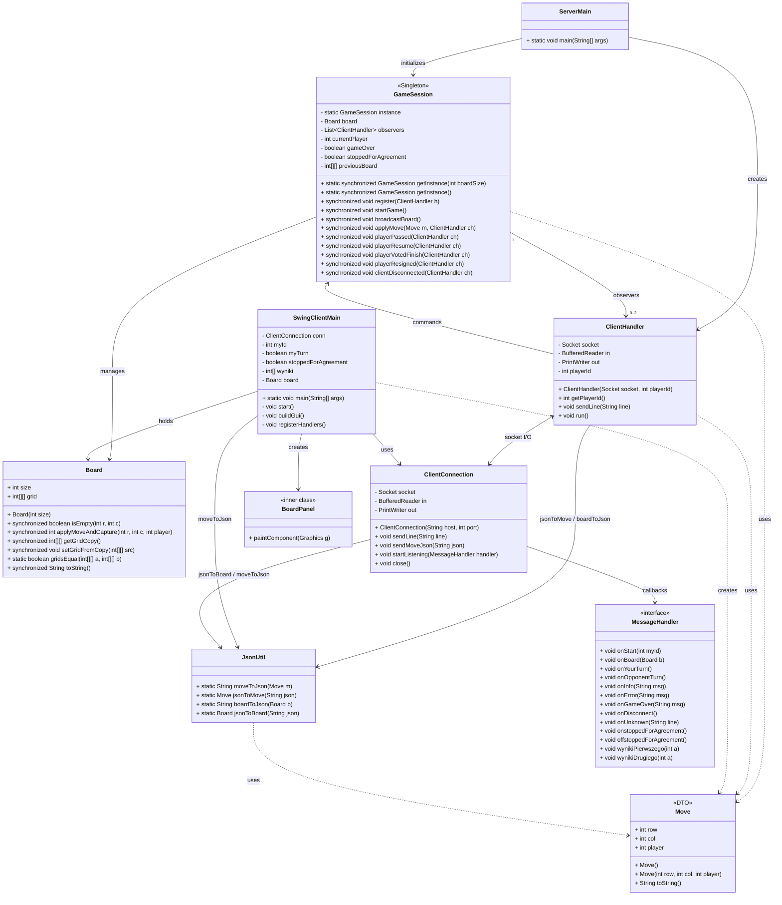

```mermaid
classDiagram
    direction TB

%% ======================
%% COMMON
%% ======================
    class Move {
        <<DTO>>
        + int row
        + int col
        + int player
        + Move()
        + Move(int row, int col, int player)
        + String toString()
    }

    class Board {
        + int size
        + int[][] grid

        + Board(int size)
        + synchronized boolean isEmpty(int r, int c)
        + synchronized int applyMoveAndCapture(int r, int c, int player)
        + synchronized int[][] getGridCopy()
        + synchronized void setGridFromCopy(int[][] src)
        + static boolean gridsEqual(int[][] a, int[][] b)
        + synchronized String toString()
    }

    class JsonUtil {
        + static String moveToJson(Move m)
        + static Move jsonToMove(String json)
        + static String boardToJson(Board b)
        + static Board jsonToBoard(String json)
    }

%% ======================
%% SERVER
%% ======================
    class GameSession {
        <<Singleton>>
        - static GameSession instance
        - Board board
        - List~ClientHandler~ observers
        - int currentPlayer
        - boolean gameOver
        - boolean stoppedForAgreement
        - int[][] previousBoard

        + static synchronized GameSession getInstance(int boardSize)
        + static synchronized GameSession getInstance()
        + synchronized void register(ClientHandler h)
        + synchronized void startGame()
        + synchronized void broadcastBoard()
        + synchronized void applyMove(Move m, ClientHandler ch)
        + synchronized void playerPassed(ClientHandler ch)
        + synchronized void playerResume(ClientHandler ch)
        + synchronized void playerVotedFinish(ClientHandler ch)
        + synchronized void playerResigned(ClientHandler ch)
        + synchronized void clientDisconnected(ClientHandler ch)
    }

    class ClientHandler {
        - Socket socket
        - BufferedReader in
        - PrintWriter out
        - int playerId

        + ClientHandler(Socket socket, int playerId)
        + int getPlayerId()
        + void sendLine(String line)
        + void run()
    }

    class ServerMain {
        + static void main(String[] args)
    }

%% ======================
%% CLIENT (SWING)
%% ======================
    class ClientConnection {
        - Socket socket
        - BufferedReader in
        - PrintWriter out

        + ClientConnection(String host, int port)
        + void sendLine(String line)
        + void sendMoveJson(String json)
        + void startListening(MessageHandler handler)
        + void close()
    }

    class SwingClientMain {
        - ClientConnection conn
        - int myId
        - boolean myTurn
        - boolean stoppedForAgreement
        - int[] wyniki
        - Board board

        + static void main(String[] args)
        - void start()
        - void buildGui()
        - void registerHandlers()
    }

    class BoardPanel {
        <<inner class>>
        + paintComponent(Graphics g)
    }

%% MessageHandler (rzeczywista wersja)
    class MessageHandler {
        <<interface>>
        + void onStart(int myId)
        + void onBoard(Board b)
        + void onYourTurn()
        + void onOpponentTurn()
        + void onInfo(String msg)
        + void onError(String msg)
        + void onGameOver(String msg)
        + void onDisconnect()
        + void onUnknown(String line)
        + void onstoppedForAgreement()
        + void offstoppedForAgreement()
        + void wynikiPierwszego(int a)
        + void wynikiDrugiego(int a)
    }

%% ======================
%% RELATIONS
%% ======================

%% Server side
    ServerMain --> ClientHandler : creates
    ServerMain --> GameSession : initializes
    GameSession "1" --> "0..2" ClientHandler : observers
    GameSession --> Board : manages
    GameSession ..> Move : uses
    ClientHandler --> GameSession : commands
    ClientHandler --> JsonUtil : jsonToMove / boardToJson
    ClientHandler ..> Move : uses

%% Client <-> Server
    ClientHandler <--> ClientConnection : socket I/O

%% Client side (Swing)
    SwingClientMain --> ClientConnection : uses
    SwingClientMain --> Board : holds
    SwingClientMain --> BoardPanel : creates
    SwingClientMain ..> Move : creates
    SwingClientMain --> JsonUtil : moveToJson
    ClientConnection --> MessageHandler : callbacks
    ClientConnection --> JsonUtil : jsonToBoard / moveToJson
    
%% other
    JsonUtil ..> Move : uses
```