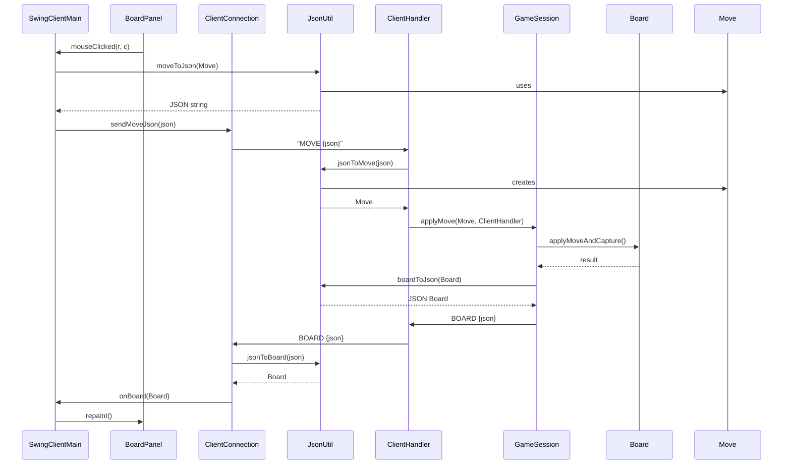

```mermaid
%% diagram sekwencji - wykonanie ruchu w grze (SwingClientMain)
sequenceDiagram
participant GUI as SwingClientMain
participant BP as BoardPanel
participant CC as ClientConnection
participant JCU as JsonUtil
participant CH as ClientHandler
participant GS as GameSession
participant B as Board

    %% --- klik na planszy ---
    BP ->> GUI: mouseClicked(r, c)
    GUI ->> JCU: moveToJson(Move)
    JCU ->> Move: uses
    JCU -->> GUI: JSON string

    %% --- wysłanie ruchu ---
    GUI ->> CC: sendMoveJson(json)
    CC ->> CH: "MOVE {json}"

    %% --- serwer ---
    CH ->> JCU: jsonToMove(json)
    JCU ->> Move: creates
    JCU -->> CH: Move

    CH ->> GS: applyMove(Move, ClientHandler)
    GS ->> B: applyMoveAndCapture()
    B -->> GS: result

    %% --- aktualizacja stanu ---
    GS ->> JCU: boardToJson(Board)
    JCU -->> GS: JSON Board
    GS ->> CH: BOARD {json}

    %% --- powrót do klienta ---
    CH ->> CC: BOARD {json}
    CC ->> JCU: jsonToBoard(json)
    JCU -->> CC: Board
    CC ->> GUI: onBoard(Board)

    GUI ->> BP: repaint()
```